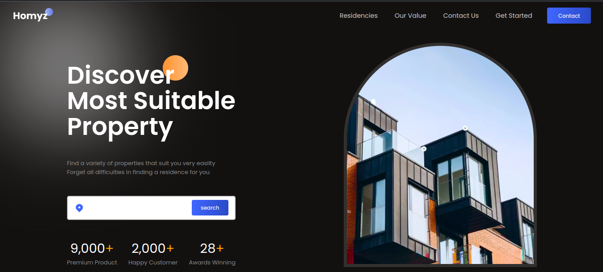

# Homyz - Real Estate Web Application

## Discover Your Dream Property with Ease

Homyz is a real estate web application designed to help you find the most suitable properties effortlessly. Our platform offers a wide variety of properties tailored to meet your needs, ensuring a smooth and stress-free property search experience.

## Key Features

- **Property Listings**: Explore a diverse range of properties with detailed information, including prices, locations, and descriptions.
- **Brand Partners**: Browse popular residencies from trusted partners such as Aliva Priva Jardin, Asatti Garden City, and Citralan Puri Serang.
- **Navigation**: Easily access different sections of the site, including Residencies, Our Value, and Contact Us.
- **Our Values**: Learn about the core values that drive our commitment to providing the best services and the most competitive prices in the market.
- **Contact Options**: Reach out to us via call, chat, video call, or message to get personalized assistance.
- **Subscription**: Subscribe to receive super attractive price quotes and updates on new properties.

## Technologies Used

- **Frontend**: HTML, CSS, JavaScript, React.js
- **Backend**: Node.js, Express.js
- **Database**: MongoDB
- **Hosting**: [domain website]

